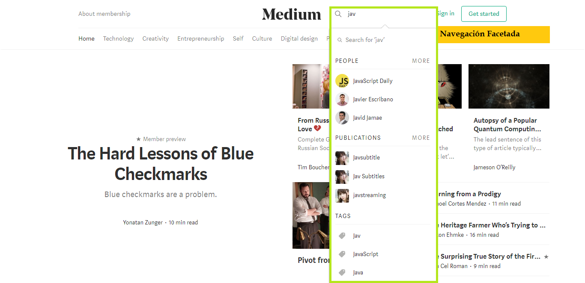

# MEDIUM
## Identificando elementos de navegación

*Navegación Global*  
La navegacion global es la navegación principal a traves de la cual podemos recorrer toda la página. En la siguiente figura identificamos la navegación global del sitio.

*Navegación facetada*  
En la siguiente figura se observa un filtro predeterminado por el sistema.

*Contextual*  
En la siguiente figura se muestra sugerencias de acuerdo al articulo que esta leyendo el usuario.

